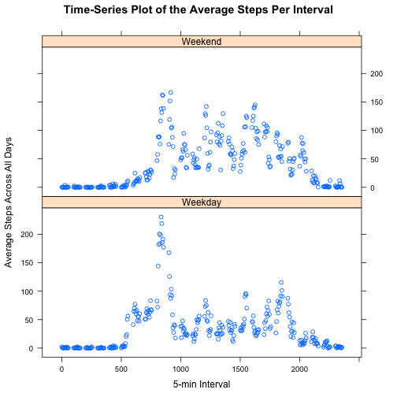

Report on Activity Monitoring Data
========================================================
# Reproducible Research: Peer Assessment 1
## Loading and preprocessing the data
* Set the Working Directory to the GitHub fork, check if data file exists, if not download the data, unzip and read it into R

```r
setwd("~/Documents/Coursera/ReproducibleResearch/Project1/RepData_PeerAssessment1")

if(!file.exists("./activity.zip")){
        url="https://d396qusza40orc.cloudfront.net/repdata%2Fdata%2Factivity.zip"
        download.file(url,method="curl",destfile="activity.zip")
}
unzip("./activity.zip")
dfAct <- read.csv("activity.csv",stringsAsFactors=FALSE)
```

* Convert the date into Date class


```r
dfAct$date <- as.Date(dfAct$date)
```
## What is mean total number of steps taken per day?

* Calculate total number of steps taken per day

```r
dfStepsPerDay <- aggregate(steps~date,dfAct,sum)
```

* Histogram of the total number of steps taken per day


```r
hist(dfStepsPerDay$steps, xlab="Total number of steps taken per day", main="Histogram of Total Steps Taken Per Day")
```

 

* Mean and median total number of steps taken per day

```r
MeanStepsPerDay <- mean(dfStepsPerDay$steps)
cat("Mean steps per day:",MeanStepsPerDay)
```

```
## Mean steps per day: 10766
```

```r
MedianStepsPerDay <- median(dfStepsPerDay$steps)
cat("Median steps per day:", MedianStepsPerDay)
```

```
## Median steps per day: 10765
```
*
## What is the average daily activity pattern?
* Time series plot of the 5-minute interval and the average number of steps taken, averaged across all days

```r
dfStepsPerInterval <- aggregate(steps~interval,dfAct,mean, na.rm=TRUE)
plot(dfStepsPerInterval, type="l", main="Time-Series Plot of the Average Steps Per Interval",xlab="5-min Interval",ylab="Average Steps Across All Days")
```

 
* 5-minute interval (on average across all the days in the dataset), that contains the maximum number of steps:

```r
dfStepsPerInterval$interval[which.max(dfStepsPerInterval$steps)]
```

```
## [1] 835
```
## Imputing missing values
* The total number of missing values in the dataset:

```r
sum(is.na(dfAct$steps))
```

```
## [1] 2304
```

* Filling in all of the missing values in the dataset. 
* The strategy uses here is to replace the NA values by the mean for that 5-minute interval. The Zoo package, na.aggregate function that replaces the NA values by the appropriate mean.
* Create a new dataset that is equal to the original dataset but with the missing data filled in.


```r
library("zoo")
```

```
## 
## Attaching package: 'zoo'
## 
## The following objects are masked from 'package:base':
## 
##     as.Date, as.Date.numeric
```

```r
dfActwoNA <- dfAct
dfActwoNA$steps<-na.aggregate(object=dfActwoNA$steps,by=dfActwoNA$interval,FUN=mean,na.rm=FALSE)
sum(is.na(dfActwoNA$steps))
```

```
## [1] 0
```

* Histogram of the total number of steps taken each day. 

```r
dfStepsPerDaywoNA <- aggregate(steps~date,dfActwoNA,sum)
```

* Histogram of the total number of steps taken per day


```r
hist(dfStepsPerDaywoNA$steps, xlab="Total number of steps taken per day", main="Histogram of Total Steps Taken Per Day")
```

 

* Mean and median total number of steps taken per day

```r
MeanStepsPerDaywoNA <- mean(dfStepsPerDaywoNA$steps)
cat("Mean steps per day after replacing NA values: ", MeanStepsPerDaywoNA)
```

```
## Mean steps per day after replacing NA values:  10766
```

```r
MedianStepsPerDaywoNA <- median(dfStepsPerDaywoNA$steps)
cat("Median steps per day after replacing NA values: ", MedianStepsPerDaywoNA)
```

```
## Median steps per day after replacing NA values:  10766
```
* As Shown above the Mean value has not chnaged but the Median Value has. 

```r
cat("Difference between Mean Steps Per day before and after removing NA Values: ", MeanStepsPerDaywoNA - MeanStepsPerDay)
```

```
## Difference between Mean Steps Per day before and after removing NA Values:  0
```

```r
cat("Difference between Median Steps Per day before and after removing NA Values: ", MedianStepsPerDaywoNA - MedianStepsPerDay)
```

```
## Difference between Median Steps Per day before and after removing NA Values:  1.189
```
* Imputing missing data on the estimates of the total daily number of steps, does not affect the mean but increases the median value of the total number of steps taken per day.

## Are there differences in activity patterns between weekdays and weekends?
* Create a new factor variable in the dataset with two levels – “weekday” and “weekend” indicating whether a given date is a weekday or weekend day.

```r
dfActwoNA$day <- factor(ifelse(as.POSIXlt(dfActwoNA$date)$wday %% 6 == 0, "Weekend", "Weekday"))
```
* Panel plot containing a time series plot  of the 5-minute interval (x-axis) and the average number of steps taken, averaged across all weekday days or weekend days (y-axis). 

```r
library("lattice")
dfStepsPerIntervalwday <- aggregate(steps~interval+day,dfActwoNA,mean, na.rm=TRUE)
xyplot(steps ~interval | day, data= dfStepsPerIntervalwday, layout = c(1,2),main="Time-Series Plot of the Average Steps Per Interval",xlab="5-min Interval",ylab="Average Steps Across All Days")
```

 
